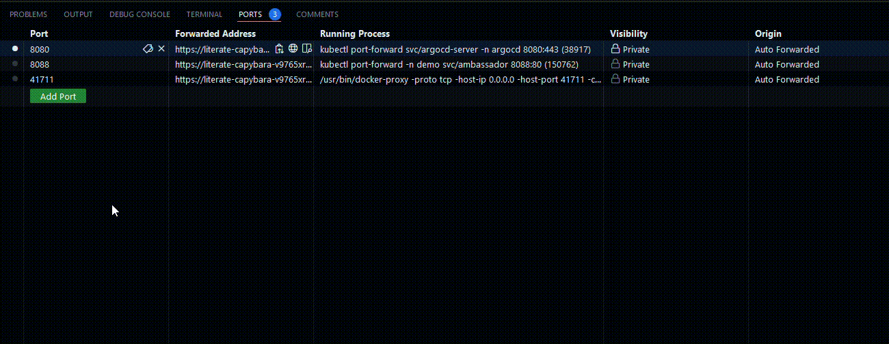

## Kubernetes cluster runnig in the codespace till I waiting for invitation to OneCloud.

### To login into ArgoCD web UI:

1. Forward argocd-server port:
```kubectl port-forward svc/argocd-server -n argocd 8080:443```
2. Change port protocol:



### To start using app:

1. Forward ambasador port
```kubectl port-forward -n demo svc/ambassador 8088:80```
2. Setup forwarded port (make public/private, change port protocol etc.)

## App converts image to ascii code:


## ArgoCD tracing github repository state for synchronization.


## If manual mode chosen when creating app in the ArgoCD follow instructions:

1. Instal cli argocd tool using: https://argo-cd.readthedocs.io/en/stable/cli_installation/
2. login into app: `argocd login localhost:8080 --usename admin`
3. use password: `kubectl -n argocd get secret argocd-initial-admin-secret -o jsonpath="{.data.password}" | base64 -d; echo`
4. set auto sync: `argocd app set <APPNAME> --sync-policy automated`