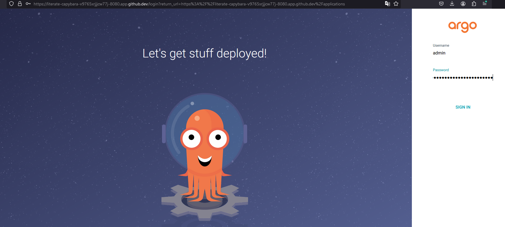

## Встановлена та налаштована система ArgoCD

Інструкції для встановлення можна занйти на сайті проекту [ArgoCD](https://argo-cd.readthedocs.io/en/stable/?_gl=1*1ncxxhs*_ga*Njc5MTk3NjIxLjE3MTI1NjEzOTk.*_ga_5Z1VTPDL73*MTcxMjU3MDU5MC4yLjAuMTcxMjU3MDU5MC4wLjAuMA..)
```
kubectl create namespace argocd
kubectl apply -n argocd -f https://raw.githubusercontent.com/argoproj/argo-cd/stable/manifests/install.yaml
```

Бінд порту:
```
kubectl port-forward svc/argocd-server -n argocd 8080:443
```

В codespace:
1. Ports
2. Change Port Protocol -> HTTPS


Отримання паролю:
```
kubectl -n argocd get secret argocd-initial-admin-secret -o jsonpath="{.data.password}" | base64 -d; echo
```

Користувач за замовчуванням - `admin`
ArgoCD буде доступний у випадку локальної машини за адресою: `https://localhost:8080`.



Створити новий проект на основі гітхаб репозиторію, провести синзронізацію:

